# Mohlat

**Got a legal notice? See what it asks, the date you need to act by, and what you can do next.**

*Mohlat* (मोहलत) is the time you're given to respond. Most people lose some of it just working out what the notice means.

- **Run it:** [locally in three commands](#run-it-locally), or deploy to Cloud Run with [`docs/deploy.md`](docs/deploy.md)
- **Challenge:** PromptWars: Virtual (Exclusive Edition), AI for Legal Assistance & Access
- **Built with:** Google Antigravity, Gemini, Cloud Run

[](https://github.com/airz-raj/by-law/actions/workflows/ci.yml)

> **Information, not legal advice.** Mohlat explains documents and procedures. It does not tell you what to decide and does not create a lawyer–client relationship. If you may be eligible for free legal aid, your District Legal Services Authority can help; NALSA's toll-free helpline is **15100**.

---

## Chosen vertical

AI for Legal Assistance & Access, narrowed to one high-stakes moment: **the day a legal notice arrives.** A demand for a bounced cheque, a bank's recovery notice, a notice to vacate a rented flat.

## The problem

A legal notice is written to be formal, not to be understood. Three things make it hard for the person who receives it:

- **The clock is hidden.** Many notices run from the day *you received* them, not the date printed at the top, and the period is set by a statute the notice mentions only by section number.
- **The notice leans on another document.** "As per clause 9 of the agreement…", but the agreement is in a drawer and nobody checks whether clause 9 actually says that.
- **Help exists but is invisible.** Free legal services are available to many people in India under the Legal Services Authorities Act, 1987. Most people who receive a notice never find out whether they qualify.

Most legal-document tools are built for the moment *before* you sign. Mohlat is built for the moment *after* something has landed on you.

## What Mohlat does

| You want to… | Mohlat gives you | Problem-statement use case |
|---|---|---|
| Understand the notice | A plain-language summary in English or Hindi, at a simple or detailed reading level. Who sent it, what they demand, which laws and clauses it cites, and every legal term explained | Simplifying complex legal documents; highlighting obligations |
| Know your deadline | A **respond-by date** calculated from the day you received the notice and a published rulebook, with the working shown step by step | Understanding options and next steps |
| Check the notice is right | A **cross-check** against the agreement the notice relies on. Each claim is marked *consistent*, *conflicts*, *not in the agreement* or *unclear*, with the exact lines from both documents | Comparing documents; highlighting inconsistencies and risks |
| Ask something specific | Answers drawn only from your documents, each with the line it came from, and a plain "your documents don't say" when they don't | Answering questions based on provided documents |
| See your options | Comply, reply in writing, negotiate, dispute with help, or seek free legal aid. What each involves, what to prepare, and what the notice says happens if it is ignored | Helping users understand options and next steps |
| Get help | A printable **briefing sheet** (facts, dates, documents to bring, questions to ask), a calendar reminder for the deadline, and a check against the free-legal-aid criteria in Section 12 of the Legal Services Authorities Act | Checklists and actionable outputs; preparing for a legal professional |

### Try it in a minute

1. Start it with `make dev`, open `http://localhost:8080`, and choose **Try a sample**, then the notice to vacate.
2. Enter any recent date as the day you received it and select **Read my notice**.
3. Read the respond-by date and open **How we worked this out**.
4. In **Check against your agreement**, load the sample rent agreement. Two of the notice's claims come back as conflicts, each with the clause that contradicts it.
5. Open **Briefing sheet** and print it, or add the deadline to your calendar.

## Approach and logic

**The model reads; the code decides.**

Gemini does the language work: reading the notice, pulling out what it demands and cites, classifying it, explaining terms, describing options. Anything a person might rely on is decided by deterministic, unit-tested code:

- **Deadlines** come from `app/core/deadlines.py` and a rulebook of statutory periods in `app/data/rules_in.json`, never from the model's arithmetic.
- **Every quote is a receipt.** When the model says the notice demands ₹48,500, it must return the exact line. `app/core/evidence.py` finds that line in your document. If it isn't there, the claim is shown as unconfirmed rather than passed off as fact.
- **Classification needs two votes.** A notice is matched to a rule only when the model's label and keyword evidence in the text agree (`app/core/rulebook.py`). Otherwise Mohlat uses the period written in the notice and says so.
- **Eligibility is a rule, not a guess.** The legal-aid check is a direct encoding of Section 12 (`app/core/legal_aid.py`).
- **Documents are data.** Text inside a document is never treated as an instruction. Lines that try to instruct an AI are flagged to the user (`app/core/screening.py`).
- **Personal numbers never reach the model.** Aadhaar numbers (checksum-validated), PAN, phone numbers, email addresses and bank account numbers are masked before any text leaves the server (`app/core/redaction.py`).

## How it works

```mermaid
flowchart LR
  A[Upload or paste notice] --> B[Extract text<br/>txt or pdf]
  B --> C[Mask personal numbers]
  C --> D[Screen for AI-directed<br/>and urgent content]
  D --> E[Gemini: one structured call<br/>validated against a schema]
  E --> F[Confirm every quote<br/>in the source text]
  F --> G[Match the rulebook<br/>model label + keywords]
  G --> H[Compute respond-by date]
  H --> I[Report with receipts]
  I --> J[Cross-check, questions,<br/>legal-aid check, briefing sheet]
```



1. **Intake.** Plain text or a text-based PDF, up to 5 MB and 30 pages. The file type is checked from its bytes, not its name.
2. **Mask.** Personal identifiers become placeholders such as `[PAN-1]`. The same number always gets the same placeholder within a request.
3. **Screen.** Instruction-like text and urgent signals (a summons, a hearing date, a possession notice) are detected before the model sees anything.
4. **Extract.** One Gemini call returns an object validated against a schema. Invalid output gets one repair attempt, then a clear error.
5. **Confirm.** Each quote is located in the masked source; the report shows which lines are confirmed and links each one to the highlighted text.
6. **Match and compute.** The rulebook match, then the respond-by date, counted by excluding the day the clock starts (General Clauses Act, 1897, s.9).
7. **Report.** One accessible page. Follow-up actions (cross-check, questions) send the masked text back, so the server keeps nothing between requests.

## The rulebook

Rules are data, each with its statutory source and the date it was last reviewed.

| Notice | Clock starts | Period | What the law provides next | Source |
|---|---|---|---|---|
| Cheque-dishonour demand | the day you receive the notice | 15 days to pay | If unpaid, the payee may file a complaint, generally within one month after the 15 days end | Negotiable Instruments Act, 1881: s.138 proviso (c), s.142(1)(b) |
| Secured-loan demand (SARFAESI) | the date of the notice | 60 days to pay the dues | You may send a representation or objection; the lender must reply with reasons within 15 days of receiving it. After 60 days the lender may take possession of or sell the secured asset | SARFAESI Act, 2002: s.13(2), s.13(3A), s.13(4) |
| Ending a month-to-month tenancy | the day you receive the notice | 15 days, where the agreement and local law don't provide otherwise | Your agreement or your state's rent law may give a different period, so run a cross-check | Transfer of Property Act, 1882: s.106 |
| Anything else | as stated in the notice | as stated in the notice | | the notice itself |

When a notice asks for less time than the rule gives, Mohlat shows both periods and plans for the earlier date.

## Architecture

```
web/  HTML, CSS, ES modules
  │
  ▼
app/api        routes, request/response schemas, problem responses
  │
  ▼
app/services   pipeline, prompts, model output schemas
  │                        │
  ▼                        ▼
app/core (pure)            app/adapters
dates, deadlines,          Gemini client, text extraction,
rulebook, evidence,        TTL cache
redaction, screening,
legal_aid
```

Dependencies point inward. `app/core` imports nothing else from the app and does no I/O; `tests/unit/test_architecture.py` fails the build if that changes. The model sits behind a small port (`app/adapters/llm.py`), so tests run against a fake and no test touches the network.

```
mohlat/
├── app/
│   ├── main.py              create_app(): middleware, routes, static files
│   ├── observability.py     JSON logging for Cloud Logging
│   ├── version.py           the version the health endpoint reports
│   ├── config.py            settings from the environment
│   ├── errors.py            error types
│   ├── api/                 routes.py, schemas.py, dependencies.py, problems.py
│   ├── services/            pipeline.py, prompts.py, llm_schemas.py
│   ├── core/                models.py, dates.py, deadlines.py, rulebook.py,
│   │                        evidence.py, redaction.py, screening.py, legal_aid.py
│   ├── adapters/            llm.py, extract.py, cache.py
│   ├── security/            headers.py, rate_limit.py, request_id.py, body_size.py
│   └── data/rules_in.json
├── web/                     index.html, css/, js/ (16 modules), i18n/, samples/
├── tests/                   unit/, integration/, web/, fixtures/
├── docs/                    deploy.md, design.md, decisions.md, prompt-journal.md
├── Dockerfile, Makefile, pyproject.toml, requirements.txt, requirements-dev.txt
├── package.json, tsconfig.json, vitest.config.js
└── .github/workflows/ci.yml
```

## Quality: what we did and where to check

| Attribute | What we did | Evidence |
|---|---|---|
| Code quality | Typed throughout and checked with `mypy --strict`; ruff for lint and format; a pure domain core; a port for the model; enums for every categorical field; versioned prompts; small single-purpose modules | `pyproject.toml`, `app/core/`, `app/adapters/llm.py`, `tests/unit/test_architecture.py` |
| Security | Personal numbers masked before model calls; files validated by magic bytes, size, page count and text length; documents delimited and screened for injected instructions; model output validated against schemas; the browser builds the page with `textContent` only; strict Content-Security-Policy and security headers; per-client rate limits; RFC 9457 error responses with no internals; no API key in production (Vertex AI through the service identity); non-root container; `bandit` and `pip-audit` in CI | `app/core/redaction.py`, `app/adapters/extract.py`, `app/core/screening.py`, `app/security/`, `web/js/dom.js`, `Dockerfile`, `.github/workflows/ci.yml` |
| Efficiency | One model call per user action; deterministic work before and after it; a content-hash cache with expiry for repeated requests; bounded output tokens; PDF parsing loaded only when a PDF arrives; no front-end framework or build step; gzip; Cloud Run scales to zero | `app/services/pipeline.py`, `app/adapters/cache.py`, `app/adapters/extract.py`, `web/` |
| Testing | Table-driven unit tests for every core rule (month ends, leap years, missing receipt dates, fabricated quotes, checksum-invalid IDs); API integration tests against a fake model; accessibility tests with axe-core; a coverage gate in CI; no network in any test | `tests/`, `Makefile`, `.github/workflows/ci.yml` |
| Accessibility | Semantic landmarks, skip link, labelled controls with hints, an error summary, live progress updates, focus moved to results, visible focus, text and shape (never colour alone) for every status, Hindi marked with `lang="hi"`, reduced-motion support, usable at 320 px width and 400 % zoom, print stylesheet, read-aloud where the browser supports it | `web/index.html`, `web/css/`, `web/js/`, `tests/web/` |
| Problem-statement alignment | Every use case in the brief maps to a working feature | [What Mohlat does](#what-mohlat-does) |

### Measured

Measured on 22 September 2026, on Python 3.12.3 and Node 22.22, by running the
commands in [Tests and checks](#tests-and-checks).

| Measure | Result |
|---|---|
| Python tests | 327 passing (247 unit, 80 integration) |
| Python coverage | 97.8% overall, 98% for `app/core` (gate: 90%) |
| Browser tests | 298 passing |
| axe-core violations | 0, on both the intake and the report state |
| `mypy --strict` | clean, 33 modules |
| `tsc --noEmit` with `strict` and `checkJs` | clean, 16 modules |
| `pip-audit` and `npm audit` | 0 known vulnerabilities |
| First-visit transfer, gzipped | 30.7 KB (page, 3 stylesheets, 16 modules, one language file) |
| Repository size | 227 KiB packed |
| Python source | 33 modules, 3,731 lines |
| Browser source | 16 modules, 1,943 lines |

Not measured, because nothing is deployed yet: live request latency, cache-hit
latency, and Lighthouse scores. `docs/deploy.md` has the commands, and these
rows will be filled from the live URL rather than estimated.

## Google services used

- **Gemini**, through the `google-genai` SDK, for structured extraction, cross-checking and grounded answers, each with a response schema.
- **Vertex AI** in production, authenticated with the Cloud Run service identity, so there is no API key to leak.
- **Cloud Run** in `asia-south1`, scaling to zero between requests.
- **Cloud Build** builds the container from source on deploy.
- **Cloud Logging** receives structured JSON logs that record timings and outcomes, never document text.

## Run it locally

Requires Python 3.12 and Node 22 or later (Node is used only for the web tests).

```bash
git clone https://github.com/airz-raj/by-law.git
cd by-law
python3.12 -m venv .venv && source .venv/bin/activate
make install            # runtime and development dependencies
cp .env.example .env    # add a Gemini API key from Google AI Studio
make dev                # http://localhost:8080
```

## Tests and checks

```bash
make test      # pytest with the coverage gate
make webtest   # vitest, axe-core and type checks for the browser code
make check     # everything CI runs: lint, format, types, security, tests
```

## Deploy

`docs/deploy.md` covers both production options: Vertex AI through the service identity (preferred, no key anywhere) and an AI Studio key held in Secret Manager.

## Configuration

| Variable | Purpose | Default |
|---|---|---|
| `LLM_BACKEND` | `aistudio` (API key) or `vertex` (service identity) | `aistudio` |
| `GEMINI_API_KEY` | AI Studio key for local development | none |
| `GEMINI_MODEL` | Gemini Flash-tier model id | set in `.env.example` |
| `GCP_PROJECT`, `GCP_LOCATION` | Vertex AI project and location | none |
| `APP_ENV` | `dev` or `prod`; `prod` turns off the interactive API docs | `dev` |
| `TRUST_PROXY` | Read the client address from `X-Forwarded-For` (set `true` on Cloud Run) | `false` |
| `RATE_LIMIT_PER_MINUTE` | Requests per client per minute on the AI endpoints | `10` |
| `CACHE_TTL_SECONDS` | How long a result can be reused for an identical request | `900` |

## Assumptions

- The jurisdiction is India. The rulebook covers three common notice types; anything else falls back to the period stated in the notice. A new rulebook file is all it takes to add another jurisdiction.
- The user knows the date they received the notice. Without it, the deadline is marked provisional and counted from the date on the notice.
- Numeric dates are read day first (DD/MM/YYYY), the Indian convention.
- Deadlines are not adjusted for public or court holidays; the report advises acting before the date.
- Documents are in English. Explanations can be in English or Hindi.
- PDFs contain selectable text. A scanned PDF is detected and the user is asked to paste the text instead.
- Names and addresses are not masked, because the explanation has to say who is asking whom for what.

## Limitations

- Mohlat cannot judge whether a notice is legally valid or whether a defence would succeed. That needs a lawyer.
- Three statutory rules are a deliberate start, not coverage of Indian law.
- Rate limits apply per server instance.
- The model can still misread a document. Receipts make that visible; they cannot rule it out.

## Privacy

- Nothing you upload is stored. Text lives in memory for the length of a request; cached results are built from masked text and expire after 15 minutes.
- No accounts, cookies, analytics or third-party scripts.
- Logs record a request id, the route, the status and timings, never document content.

## License

MIT
